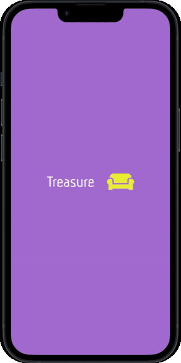

<h2>
  Hi there, I'm Yahel Baduch! 👋
  </h2>
  

      I'm a <strong>Software Developer</strong> with a passion for solving problems and creating meaningful technology. 
      Currently, I'm wrapping up my BSc in Computer Science & Cognitive Science 
      at The Hebrew University of Jerusalem, where I've dived deep into
      algorithms, machine learning, and cognitive science.
  

  

   ### 💻 Technologies & Tools
   - **Languages:** Python, Java, C/C++, R
   - **Tools:** Git, JIRA, MERN stack (MongoDB, Express, React Native, Node.js)

     

  

  
  ### 🌱 What I'm Working On
  After graduating, I understood that I want to use the power of computer science to make daily life processes more accessible for people in need.
I'm developing an app called <b>Urban Treasure Hunt</b> 🗺️, a mobile platform promoting social and environmental sustainability. 
Users can upload and pin locations of found objects, encouraging reuse and reducing waste. 
This project was selected for the Social Accelerator program at the Hebrew University’s 
Innovation Center, and I'm super excited about its potential impact!

  
  

### 📫 How to Reach Me
- **Email:** [yahelbaduch@gmail.com](mailto:yahelbaduch@gmail.com)
- **LinkedIn:** [Yahel Baduch](http://www.linkedin.com/in/yahel-baduch)
  
