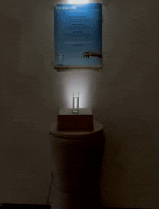
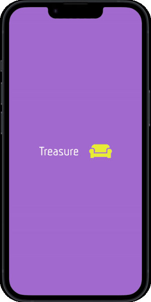

<h2>Hi there, I'm Yahel! 👋</h2>

    I am Software Developer</strong> and an M.Sc. student in Media & Human-Centered Computing at TU Wien. My background is a mix of Computer Science and Cognitive Science, which drives my passion for Human-Computer Interaction (HCI).

    My focus is crafting complete, end-to-end experiences that seamlessly connect physical user behavior with digital system logic. To actually build and test these concepts, I utilize Google Gemini as my daily coding assistant. Whether I am prototyping custom web tools or engineering interactive hardware, collaborating with an AI assistant allows me to rapidly program functional prototypes, learn new technologies on the fly, and turn complex ideas into working reality.

### 💻 Technologies & Tools
- **Languages:** Python, JavaScript, HTML/CSS, C/C++, Java, SQL
- **Full Stack & Web:** Node.js, React Native, Express, MongoDB
- **AI & Automation:** Google Gemini (Workflow Automation & Code Generation), LLM Prompting
- **Hardware & Fabrication:** ESP32/Microcontrollers, Arduino, PlatformIO, G-code generation

---

### 🚀 Featured Projects

#### 🛠️ HAYUSH: Custom Web-Based Toolpath Compiler
A full-stack web application (HTML/JS, Python) that automates the production pipeline for my 3D-printing brand, [HAYUSH](https://hayush.at). It acts as a custom compiler, letting users interact with a 2D digital interface that translates directly into physical machine execution code (G-code), bypassing standard slicing software entirely.

 
 

#### 🧩 Interactive Voxel Builder & Web Simulator
A tangible educational tool for kids to learn 3D modeling. Users snap together smart, electronically readable blocks to build physical shapes. The system reads this physical interaction and mirrors it live in a web-based simulator, instantly converting the physical structure into a 3D-printable STL file.

 
 

#### 💧 Interactive Data Physicalization: Museum Artifact
An interactive museum artifact that turns global water statistics into a physical experience of inaccessibility. Built with an ESP32 and ultrasonic sensors in C++, the system tracks a user's proximity in real-time. As users reach for the water, data-driven LED animations trigger to keep it "locked" away, using the frustration of the physical interaction to communicate real-world water scarcity.

 
 

#### 🗺️ Treasure: Urban Sustainability App
A location-based mobile app built with React Native, Node.js, and MongoDB to promote urban sustainability. Users interact with a live map to pin and find abandoned street objects in their city, encouraging local reuse. 

 

---

### 📫 How to Reach Me
- **Email:** [yahelbaduch@gmail.com](mailto:yahelbaduch@gmail.com)
- **LinkedIn:** [Yahel Baduch](http://www.linkedin.com/in/yahel-baduch)
- **Brand:** [hayush.at](https://hayush.at)
